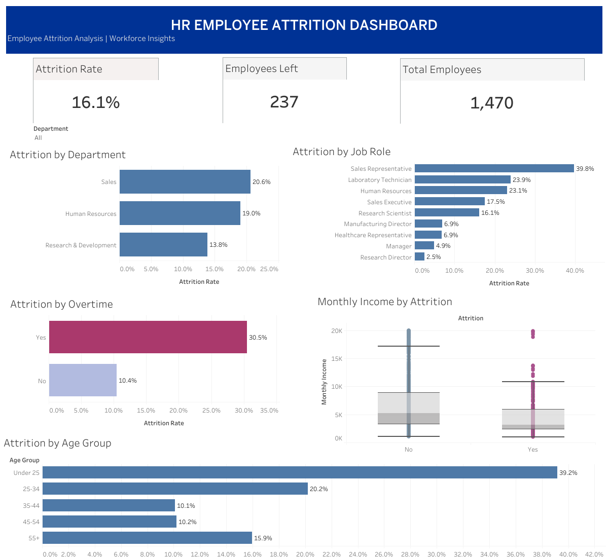

# HR Employee Attrition Analysis

## Project Overview
This project analyzes employee attrition using the IBM HR Analytics dataset. The goal is to identify workforce patterns associated with employee turnover and highlight employee groups with higher observed attrition.

The analysis is presented through an interactive dashboard built using Tableau Public.

## Tools Used
- Tableau Public
- Microsoft Excel / CSV
- GitHub

## Dataset
The dataset contains **1,470 employee records** and **35 features**, including employee demographics, job roles, income, overtime status, job satisfaction, and years of experience.

## Key Metrics
- Total Employees: **1,470**
- Employees Left: **237**
- Attrition Rate: **16.1%**

## Key Insights
- The **Sales department** has the highest department attrition rate at **20.6%**.
- **Sales Representatives** have the highest attrition rate among job roles at **39.8%**.
- Employees working **overtime** have a higher attrition rate (**30.5%**) than employees who do not work overtime (**10.4%**).
- Employees **under 25 years old** have the highest attrition rate among age groups at **39.2%**.
- Employees who left show a generally lower monthly income distribution than employees who stayed.

## Recommendations
- Prioritize retention initiatives for high-attrition roles, especially Sales Representatives.
- Review workload and overtime practices.
- Strengthen career development and retention programs for younger employees.
- Further investigate compensation and career progression among high-attrition employee groups.

## Dashboard

## Tableau Public

**[View Interactive Dashboard](https://public.tableau.com/app/profile/firly.fauzi/viz/HREmployeeAttritionAnalysis_17889248471260/Dashboard1)**

## Repository Files
- `hr_employee_attrition.csv` - Dataset used for the analysis
- `hr_attrition_dashboard.png` - Dashboard preview
- `README.md` - Project documentation
